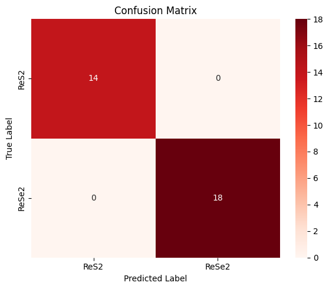

# Classification of crystals using Raman spectra and Deep Learning

In this project, a neural network classification model is created to identify materials from their Raman spectra. The Raman spectra in this project belong to the crystals **ReS<sub>2</sub>** and **ReSe<sub>2</sub>**, these crystals have a large number of non-degenerate vibrational modes, and as a result, the Raman spectra contain numerous features that can be identified by a classification model.   

## Technical Details

The model is implemented using **TensorFlow** and **Keras**, employing **Conv1D** layers to process the 1D spectral data.   

## Model Architecture
- Conv1D layers for feature extraction.
- Dense layers with dropout for regularisation.
- Sigmoid output for binary classification.

## Key Features
- Raman spectra were simulated using Voigt profiles to represent the Raman modes. The peak positions and widths were slightly varied to introduce diversity, and random noise was added to the data.
- **Custom Data Generator** for 1D Raman spectra.  
- **Conv1D Architecture** to discern identifiable features from the spectra.  
- **Hyperparameter Tuning** using Keras Tuner.  
- **Evaluation Metrics**: Confusion Matrix, ROC Curve, Classification Report.

## Results and Further Work
- **Validation Accuracy**: 100%
- **ROC AUC**: 1.0
- **Confusion Matrix**  
    
  The next steps in this project would be to retrieve Raman spectra from a database to further train this model.


## Setup instructions

>Note: The Raman spectra are not included in this repository, but the code, step-by-step instructions, results, and visualisations are all available. If wanted the user can download the repository and use their own data.

```bash
git clone https://github.com/lsh-cloud/Neural-network-Raman-spectroscopy.git
cd Neural-network-Raman-spectroscopy  
pip install -r requirements.txt  


